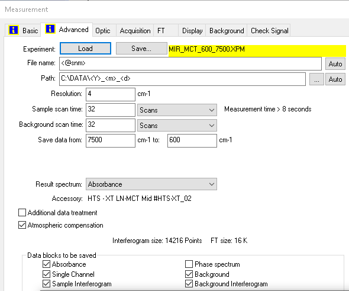
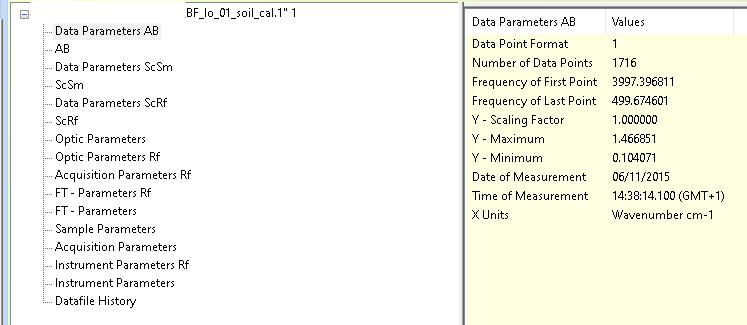

# Reading OPUS binary files from Bruker® spectrometers in R
Philipp Baumann and Thomas Knecht
2026-01-09

# Motivation

Spectrometers from [Bruker® Optics GmbH &
Co.](https://www.bruker.com/en.html) save spectra in a special file
format called OPUS. Each OPUS file is linked to one aggregated sample
measurement, which is usually obtained using the OPUS spectroscopy
software. These files have numbers as file extensions, and the numbers
typically increase sequentially for each sample name, based on the
settings chosen in the OPUS software. The OPUS suite and file
specification are proprietary, so we had to implement this package using
reverse engineering. With opusreader2, you can extract your
spectroscopic data directly in R, giving you full control over your
spectral data workflow. Our package is designed to handle binary files
for most Fourier-Transform Infrared (FT-IR) spectrometers from Bruker®
Optics GmbH. It might also work for other products, such as Raman
spectrometers, but in these cases, additional adjustments may be needed
to support new block types (for both data and parameters; see below).

# OPUS data extraction

Each OPUS file is processed by first extracting metadata information
from a dedicated part of the file header. This section contains all the
important information about binary blocks (also called chunks), such as
byte offsets, sizes, and data types at different byte locations in the
file. The parsing algorithm uses this information to extract various
data and parameter blocks from byte sequences. As the picture below
shows, the content of the files changes based on the instrument type,
the data (spectrum) blocks that the user chooses to save, and the
specific measurement settings.

<figure id="fig:opus_settings">

<figcaption aria-hidden="true">OPUS measurement settings for Bruker
INVENIO® Fourier-transform (FT) mid-infrared spectrometer</figcaption>
</figure>

In addition to result spectra, the binary files include:

- a comprehensive set of measurement parameters (configurations,
  conditions)
- single-channel data from background measurements performed before the
  sample
- other types of intermediate spectra

Currently, we support the *“data blocks to be saved”* for
Fourier-transform infrared spectrometers.

## Reading and parsing OPUS files in R

The main function, `read_opus()`, reads one or more OPUS files and
returns a nested list of class `list_opusreader2`. Each list contains
both the spectral data and metadata for each file.

Let’s see how this works using an example file from a Bruker ALPHA®
spectrometer. This instrument measures mid-infrared spectra, here using
a diffuse-reflectance accessory. The soil sample measurement shown is
included with the package and is also part of the data set in [Baumann
et al. (2020)](https://soil.copernicus.org/articles/7/717/2021/).

<figure>

<figcaption aria-hidden="true">Data parameters for absorbance (AB)
spectrum</figcaption>
</figure>

We can extract all these blocks from the example OPUS file. In fact, we
can access even more blocks than are displayed in the official OPUS
software.

``` r
library("opusreader2")
# example file
file_1 <- system.file("extdata", "test_data", "BF_lo_01_soil_cal.1",
  package = "opusreader2"
)
spectrum_1 <- read_opus(dsn = file_1)
```

The `dsn` argument is the data source name. It can be a character vector
of folder paths (to read files recursively) or specific OPUS file paths.

**`read_opus()`** returns a nested list of class `"list_opusreader2"`.

``` r
class(spectrum_1)
#> [1] "list_opusreader2" "list"
names(spectrum_1)
#> [1] "BF_lo_01_soil_cal.1"
```

At the top level, the list structure matches how data is organized in
the Bruker OPUS viewer.

``` r
meas_1 <- spectrum_1[["BF_lo_01_soil_cal.1"]]
names(meas_1)
#>  [1] "basic_metadata"             "ab_no_atm_comp_data_param" 
#>  [3] "ab_no_atm_comp"             "ab_data_param"             
#>  [5] "ab"                         "sc_sample_data_param"      
#>  [7] "sc_sample"                  "sc_ref_data_param"         
#>  [9] "sc_ref"                     "optics"                    
#> [11] "optics_ref"                 "acquisition_ref"           
#> [13] "fourier_transformation_ref" "fourier_transformation"    
#> [15] "sample"                     "acquisition"               
#> [17] "instrument_ref"             "instrument"                
#> [19] "history"
```

To understand block names and their contents, see the help page
`?read_opus`. Block names use `camel_case` at the second level of the
`"opusreader2_list"` output, making them easy to access
programmatically.

Printing the entire `"opusreader2_list"` can flood the console. For
easier exploration, use RStudio’s *list preview* with `View(spectrum_1)`
or examine specific elements with `names()` and `str()`.

Some list elements may not be visible in the Bruker® viewer pane, but we
compile them because they are either useful or actually part of the
files:

1.  `basic_metadata`: Minimal metadata to identify measurements,
    including file name, sample name, and timestamps. Useful for
    organizing spectral libraries and prediction workflows.
2.  `ab_no_atm_comp_data_param`: Parameters for the absorbance (AB)
    block before atmospheric compensation.
3.  `ab_no_atm_comp`: Absorbance data before atmospheric compensation.

``` r
str(meas_1$basic_metadata)
#> 'data.frame':    1 obs. of  6 variables:
#>  $ dsn_filename        : chr "BF_lo_01_soil_cal.1"
#>  $ opus_sample_name    : chr "BF_lo_01_soil_cal"
#>  $ timestamp_string    : chr "2015-11-06 14:39:33 GMT+1"
#>  $ local_datetime      : chr "2015-11-06 14:39:33"
#>  $ local_timezone      : chr "GMT+1"
#>  $ utc_datetime_posixct: POSIXct, format: "2015-11-06 13:39:33"
```

All types of data and parameters within OPUS files are encoded with
three capital letters each.

For example, to check the frequency of the first point (FXV), use:

``` r
meas_1$ab_data_param$parameters$FXV$parameter_value
#> [1] 3997.397
```

Besides the data or parameter values, the output of each parsed OPUS
block contains the block type, channel type, text type, additional type,
the offset in bytes, next offset in bytes, and the chunk size in bytes
for particular data blocks. This is decoded from the file header and
allows for traceability in the parsing process.

``` r
class(meas_1$ab_data_param)
#> [1] "parameter"
str(meas_1$ab_data_param)
#> List of 9
#>  $ block_type     : int 31
#>  $ channel_type   : int 16
#>  $ text_type      : int 0
#>  $ additional_type: int 0
#>  $ offset         : int 33424
#>  $ next_offset    : int 33600
#>  $ chunk_size     : int 176
#>  $ block_type_name: chr "ab_data_param"
#>  $ parameters     :List of 10
#>   ..$ DPF:List of 4
#>   .. ..$ parameter_name     : chr "DPF"
#>   .. ..$ parameter_name_long: chr "Data Point Format"
#>   .. ..$ parameter_value    : int 1
#>   .. ..$ parameter_type     : chr "int"
#>   ..$ NPT:List of 4
#>   .. ..$ parameter_name     : chr "NPT"
#>   .. ..$ parameter_name_long: chr "Number of Data Points"
#>   .. ..$ parameter_value    : int 1716
#>   .. ..$ parameter_type     : chr "int"
#>   ..$ FXV:List of 4
#>   .. ..$ parameter_name     : chr "FXV"
#>   .. ..$ parameter_name_long: chr "Frequency of First Point"
#>   .. ..$ parameter_value    : num 3997
#>   .. ..$ parameter_type     : chr "float"
#>   ..$ LXV:List of 4
#>   .. ..$ parameter_name     : chr "LXV"
#>   .. ..$ parameter_name_long: chr "Frequency of Last Point"
#>   .. ..$ parameter_value    : num 500
#>   .. ..$ parameter_type     : chr "float"
#>   ..$ CSF:List of 4
#>   .. ..$ parameter_name     : chr "CSF"
#>   .. ..$ parameter_name_long: chr "Y - Scaling Factor"
#>   .. ..$ parameter_value    : num 1
#>   .. ..$ parameter_type     : chr "float"
#>   ..$ MXY:List of 4
#>   .. ..$ parameter_name     : chr "MXY"
#>   .. ..$ parameter_name_long: chr "Y - Maximum"
#>   .. ..$ parameter_value    : num 1.47
#>   .. ..$ parameter_type     : chr "float"
#>   ..$ MNY:List of 4
#>   .. ..$ parameter_name     : chr "MNY"
#>   .. ..$ parameter_name_long: chr "Y - Minimum"
#>   .. ..$ parameter_value    : num 0.104
#>   .. ..$ parameter_type     : chr "float"
#>   ..$ DAT:List of 4
#>   .. ..$ parameter_name     : chr "DAT"
#>   .. ..$ parameter_name_long: chr "Date of Measurement"
#>   .. ..$ parameter_value    : chr "06/11/2015"
#>   .. ..$ parameter_type     : chr "str"
#>   ..$ TIM:List of 4
#>   .. ..$ parameter_name     : chr "TIM"
#>   .. ..$ parameter_name_long: chr "Time of Measurement"
#>   .. ..$ parameter_value    : chr "14:38:14.100 (GMT+1)"
#>   .. ..$ parameter_type     : chr "str"
#>   ..$ DXU:List of 4
#>   .. ..$ parameter_name     : chr "DXU"
#>   .. ..$ parameter_name_long: chr "X Units"
#>   .. ..$ parameter_value    : chr "WN"
#>   .. ..$ parameter_type     : chr "str"
#>  - attr(*, "class")= chr "parameter"
```

``` r
str(meas_1$instrument)
#> List of 9
#>  $ block_type     : int 32
#>  $ channel_type   : int 0
#>  $ text_type      : int 0
#>  $ additional_type: int 64
#>  $ offset         : int 26160
#>  $ next_offset    : int 26560
#>  $ chunk_size     : int 400
#>  $ block_type_name: chr "instrument"
#>  $ parameters     :List of 27
#>   ..$ HFL:List of 4
#>   .. ..$ parameter_name     : chr "HFL"
#>   .. ..$ parameter_name_long: chr "Hight Folding Limit"
#>   .. ..$ parameter_value    : num 16707
#>   .. ..$ parameter_type     : chr "float"
#>   ..$ LFL:List of 4
#>   .. ..$ parameter_name     : chr "LFL"
#>   .. ..$ parameter_name_long: chr "Low Folding Limit"
#>   .. ..$ parameter_value    : num 0
#>   .. ..$ parameter_type     : chr "float"
#>   ..$ LWN:List of 4
#>   .. ..$ parameter_name     : chr "LWN"
#>   .. ..$ parameter_name_long: chr "Laser Wavenumber"
#>   .. ..$ parameter_value    : num 11602
#>   .. ..$ parameter_type     : chr "float"
#>   ..$ ABP:List of 4
#>   .. ..$ parameter_name     : chr "ABP"
#>   .. ..$ parameter_name_long: chr "Absolute Peak Pos in Laser*2"
#>   .. ..$ parameter_value    : int 999951
#>   .. ..$ parameter_type     : chr "int"
#>   ..$ SSP:List of 4
#>   .. ..$ parameter_name     : chr "SSP"
#>   .. ..$ parameter_name_long: chr "Sample Spacing Divisor"
#>   .. ..$ parameter_value    : int 1
#>   .. ..$ parameter_type     : chr "int"
#>   ..$ HUM:List of 4
#>   .. ..$ parameter_name     : chr "HUM"
#>   .. ..$ parameter_name_long: chr "Relative Humidity Interferometer"
#>   .. ..$ parameter_value    : int 25
#>   .. ..$ parameter_type     : chr "int"
#>   ..$ RSN:List of 4
#>   .. ..$ parameter_name     : chr "RSN"
#>   .. ..$ parameter_name_long: chr "Running Sample Number"
#>   .. ..$ parameter_value    : int 1891
#>   .. ..$ parameter_type     : chr "int"
#>   ..$ SRT:List of 4
#>   .. ..$ parameter_name     : chr "SRT"
#>   .. ..$ parameter_name_long: chr "Start time (sec)"
#>   .. ..$ parameter_value    : num 1.45e+09
#>   .. ..$ parameter_type     : chr "float"
#>   ..$ DUR:List of 4
#>   .. ..$ parameter_name     : chr "DUR"
#>   .. ..$ parameter_name_long: chr "Scan time (sec)"
#>   .. ..$ parameter_value    : num 79.6
#>   .. ..$ parameter_type     : chr "float"
#>   ..$ TSC:List of 4
#>   .. ..$ parameter_name     : chr "TSC"
#>   .. ..$ parameter_name_long: chr "Scanner Temperature"
#>   .. ..$ parameter_value    : num 33.7
#>   .. ..$ parameter_type     : chr "float"
#>   ..$ MVD:List of 4
#>   .. ..$ parameter_name     : chr "MVD"
#>   .. ..$ parameter_name_long: chr "Max. Velocity Deviation"
#>   .. ..$ parameter_value    : num 1.56
#>   .. ..$ parameter_type     : chr "float"
#>   ..$ APG:List of 4
#>   .. ..$ parameter_name     : chr "APG"
#>   .. ..$ parameter_name_long: chr "Actual preamplifier gain"
#>   .. ..$ parameter_value    : num 1
#>   .. ..$ parameter_type     : chr "float"
#>   ..$ HUA:List of 4
#>   .. ..$ parameter_name     : chr "HUA"
#>   .. ..$ parameter_name_long: chr "Absolute Humidity Interferometer"
#>   .. ..$ parameter_value    : num 9.52
#>   .. ..$ parameter_type     : chr "float"
#>   ..$ VSN:List of 4
#>   .. ..$ parameter_name     : chr "VSN"
#>   .. ..$ parameter_name_long: chr "Firmware version"
#>   .. ..$ parameter_value    : chr "1.352 Dec 04 2012"
#>   .. ..$ parameter_type     : chr "str"
#>   ..$ SRN:List of 4
#>   .. ..$ parameter_name     : chr "SRN"
#>   .. ..$ parameter_name_long: chr "Instrument Serial Number"
#>   .. ..$ parameter_value    : chr "2 00639"
#>   .. ..$ parameter_type     : chr "str"
#>   ..$ PKA:List of 4
#>   .. ..$ parameter_name     : chr "PKA"
#>   .. ..$ parameter_name_long: chr "Peak Amplitude"
#>   .. ..$ parameter_value    : int -438
#>   .. ..$ parameter_type     : chr "int"
#>   ..$ PKL:List of 4
#>   .. ..$ parameter_name     : chr "PKL"
#>   .. ..$ parameter_name_long: chr "Peak Location"
#>   .. ..$ parameter_value    : int 7518
#>   .. ..$ parameter_type     : chr "int"
#>   ..$ GFW:List of 4
#>   .. ..$ parameter_name     : chr "GFW"
#>   .. ..$ parameter_name_long: chr "Number of Good FW Scans"
#>   .. ..$ parameter_value    : int 32
#>   .. ..$ parameter_type     : chr "int"
#>   ..$ BFW:List of 4
#>   .. ..$ parameter_name     : chr "BFW"
#>   .. ..$ parameter_name_long: chr "Number of Bad FW Scans"
#>   .. ..$ parameter_value    : int 0
#>   .. ..$ parameter_type     : chr "int"
#>   ..$ PRA:List of 4
#>   .. ..$ parameter_name     : chr "PRA"
#>   .. ..$ parameter_name_long: chr "Backward Peak Amplitude"
#>   .. ..$ parameter_value    : int -437
#>   .. ..$ parameter_type     : chr "int"
#>   ..$ PRL:List of 4
#>   .. ..$ parameter_name     : chr "PRL"
#>   .. ..$ parameter_name_long: chr "Backward Peak Location"
#>   .. ..$ parameter_value    : int 7518
#>   .. ..$ parameter_type     : chr "int"
#>   ..$ GBW:List of 4
#>   .. ..$ parameter_name     : chr "GBW"
#>   .. ..$ parameter_name_long: chr "Number of Good BW Scans"
#>   .. ..$ parameter_value    : int 32
#>   .. ..$ parameter_type     : chr "int"
#>   ..$ BBW:List of 4
#>   .. ..$ parameter_name     : chr "BBW"
#>   .. ..$ parameter_name_long: chr "Number of Bad BW Scans"
#>   .. ..$ parameter_value    : int 0
#>   .. ..$ parameter_type     : chr "int"
#>   ..$ INS:List of 4
#>   .. ..$ parameter_name     : chr "INS"
#>   .. ..$ parameter_name_long: chr "Instrument Type"
#>   .. ..$ parameter_value    : chr "Alpha"
#>   .. ..$ parameter_type     : chr "str"
#>   ..$ FOC:List of 4
#>   .. ..$ parameter_name     : chr "FOC"
#>   .. ..$ parameter_name_long: chr "Focal Length"
#>   .. ..$ parameter_value    : num 33
#>   .. ..$ parameter_type     : chr "float"
#>   ..$ RDY:List of 4
#>   .. ..$ parameter_name     : chr "RDY"
#>   .. ..$ parameter_name_long: chr "Ready Check"
#>   .. ..$ parameter_value    : chr "1"
#>   .. ..$ parameter_type     : chr "str"
#>   ..$ ASS:List of 4
#>   .. ..$ parameter_name     : chr "ASS"
#>   .. ..$ parameter_name_long: chr "Number of Sample Scans"
#>   .. ..$ parameter_value    : int 64
#>   .. ..$ parameter_type     : chr "int"
#>  - attr(*, "class")= chr "parameter"
```

This example spectrum was measured with atmospheric compensation
(removing masking information from carbon dioxide and water vapor
bands), as set in the OPUS software. OPUS files track all processing
steps and macros, so you can access both raw and processed data. This
enables thorough quality control before modeling or making predictions
on new samples.

## Reading OPUS files recursively from a folder

You can also provide a folder as the data source name (`dsn`). This
makes it easy to read all OPUS files found within a folder and its
subfolders. Here, we demonstrate this using the test files that come
with the {opusreader2} package, which are also used for unit testing.

``` r
test_dsn <- system.file("extdata", "test_data", package = "opusreader2")
data_test <- read_opus(dsn = test_dsn)
names(data_test)
#> [1] "617262_1TP_C-1_A5.0" "629266_1TP_A-1_C1.0" "BF_lo_01_soil_cal.1"
#> [4] "MMP_2107_Test1.001"  "test_spectra.0"
```

To get the instrument name from each test file, you can use:

``` r
get_instrument_name <- function(data) {
  return(data$instrument$parameters$INS$parameter_value)
}

lapply(data_test, get_instrument_name)
#> $`617262_1TP_C-1_A5.0`
#> [1] "INVENIO-R"
#> 
#> $`629266_1TP_A-1_C1.0`
#> [1] "VERTEX 70"
#> 
#> $BF_lo_01_soil_cal.1
#> [1] "Alpha"
#> 
#> $MMP_2107_Test1.001
#> [1] "Tango"
#> 
#> $test_spectra.0
#> [1] "TENSOR II"
```

## Reading OPUS files in parallel

We implemented a parallel interface in `read_opus()` to efficiently read
large collections of spectra from multiple OPUS files. The default and
recommended backend, [mirai](https://mirai.r-lib.org/), orchestrates
reading files concurrently using asynchronous parallel mapping over
individual OPUS files. The main advantage is faster reads, better and
also fault-tolerant error handling (i.e. custom) actions when a file
cannot be read.

Behind the scene, mirai uses
[nanonext](https://github.com/r-lib/nanonext/) and
[NNG](https://nng.nanomsg.org/) (Nanomsg Next Gen) messaging, which
allows high throughput and low latency between individual R processes.

All you have to do is launching daemons.

``` r
if (!require("mirai")) {
  library("mirai")
  daemons(n = 2L, dispatcher = TRUE)

  (data <- read_opus(dsn = files_1000, parallel = TRUE))
}
```

The task of reading files can be done locally or through distributed
systems over a network. For further details, check out the mirai, and
its vignettes.

## Reading a single OPUS file

For individual OPUS files, you can use the `read_opus_single()`
function. We export it as a developer interface.

``` r
data_single <- read_opus_single(dsn = file_1)
```
